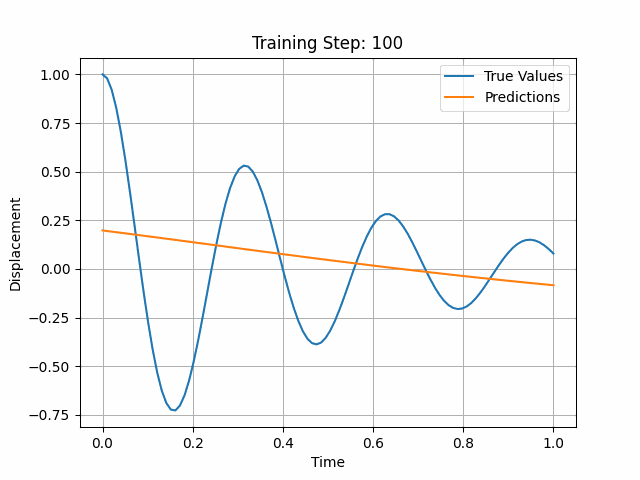

# Physics Informed Neural Network (PINN)

<i>Animation illustrating a PINN model applied to an Harmonic Oscillator Problem</i>

Physics-Informed Neural Networks (PINNs) are neural networks that integrate the principles of physics into the learning process enabling them to solve supervised learning tasks while ensuring adherence to physical laws represented by partial differential equations (PDEs). They serve as universal function approximators, capable of embedding knowledge of the governing physics within the data, thereby enhancing the model's ability to achieve accurate and physically consistent predictions.

## Applications

PINNs are capable of solving both **forward problems** (simulating the system’s behavior given known parameters and initial conditions) and **inverse problems** (inferring unknown parameters within a system from observed data). This flexibility makes them applicable to a wide variety of scientific and engineering challenges.

In this repository, I utilized PINNs for the following tasks:

- Harmonic Oscillator
- Burgers' Equation
- Navier-Stokes Equations

## References

B. Moseley (2021). [*So, what is a Physics-Informed Neural Network?*](https://benmoseley.blog/my-research/so-what-is-a-physics-informed-neural-network/) *Ben Moseley's Blog*

M. Raissi, P. Perdikaris, & G. E. Karniadakis (2019). [*Physics-informed neural networks: A deep learning framework for solving forward and inverse problems involving nonlinear partial differential equations.*](https://www.sciencedirect.com/science/article/abs/pii/S0021999118307125)

## Additional Reading
Steve Brunton's Youtube Playlist [*Physics Informed Machine Learning*](https://www.youtube.com/playlist?list=PLMrJAkhIeNNQ0BaKuBKY43k4xMo6NSbBa)